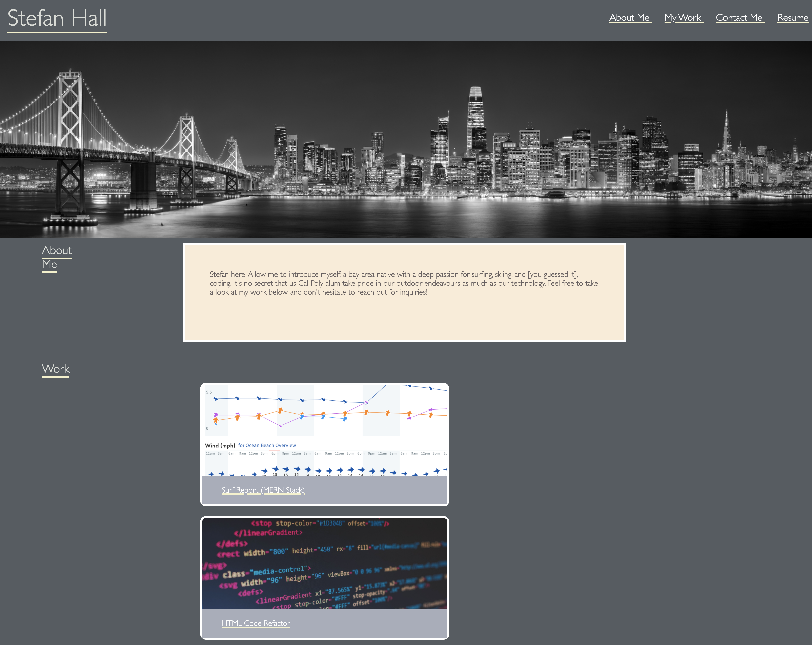

# Challenge-02-Advanced-CSS-Portfolio

Class: UCB-VIRT-BO-FSF-PT-03-2021-U-B-MW

Challenge: Challenge-02 Advanced CSS Challenge: Professional Portfolio

## Purpose

This code repository is a deployment of original HTML/ CSS to create a portfolio for myself. The purpose of this is to create a baseline structure that I will continue to improve and refactor as I develop new things in the future.

## Built With
* HTML
* CSS

## Contribution
Made by Stefan Hall

### 2021 Challenge-02 Advanced CSS Portfolio

Link to Deployed Application: https://surferstef.github.io/Challenge-02-Advanced-CSS-Portfolio/

## Screenshot
